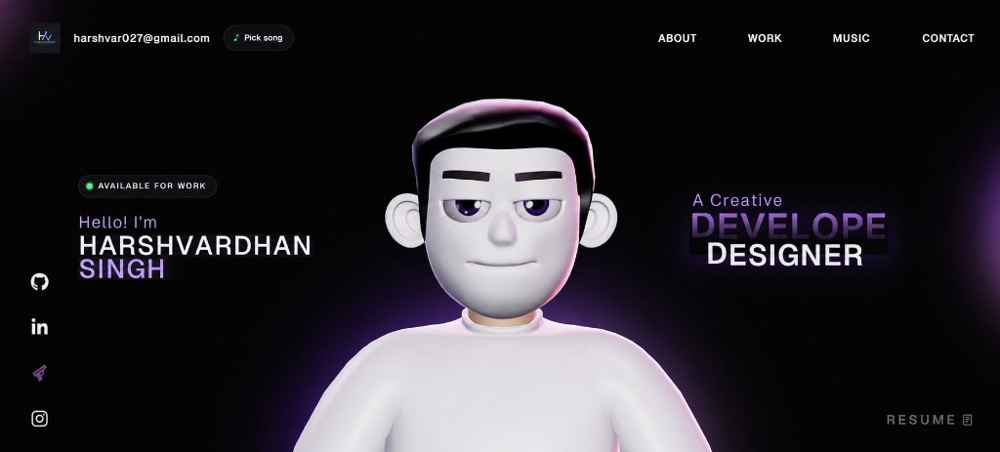

# Portfolio Website

Open-source version of my personal portfolio — a scroll-driven, music-reactive site built with React, Three.js, and GSAP.



---

## Features

### Core experience

- **3D character** — interactive GLB avatar with lighting, intro animation, and scroll-driven camera paths
- **Scroll animations** — GSAP ScrollTrigger, ScrollSmoother, and SplitText across landing, about, work, and career sections
- **Loading screen** — staged progress with a reveal handoff into the main site
- **Custom cursor** — smooth follow cursor with hover states
- **Name reveal** — Matter.js physics canvas with draggable letter bodies
- **Work showcase** — horizontal pinned scroll with lazy-loaded project previews (3D + canvas demos)

### WebGL & motion

- **Tech stack showcase** — React Three Fiber sphere grid with physics and post-processing
- **Particle morph** — scroll-scrubbed WebGL particles that morph into a profile portrait
- **Soundscape** — music-reactive portal visuals tied to playback energy and BPM
- **Site gradient** — scroll-driven background morph from deep black to royal purple

### Music system

- **Spotify integration** — search and play **30-second previews** without login; optional Premium connect for full tracks via PKCE OAuth
- **Music notch** — Dynamic Island–style player with compact and expanded states, waveform bars, and play/pause controls
- **Synced lyrics** — LRC lyrics fetched from [LRCLIB](https://lrclib.net) with karaoke-style word highlighting in the notch
- **Mood engine** — track energy/valence drive CSS variables for ambient glow and motion across the site
- **Music search** — dedicated search UI; open from the navbar **Pick song** button (no forced modal on load)

Music features are optional — the site works without Spotify credentials.

### Other

- **Comments** — visitor feedback form (local dev via Vite middleware; not persisted in production)

---

## Tech Stack

| Layer | Tools |
|---|---|
| UI | React 18, TypeScript, Vite |
| Animation | GSAP (ScrollTrigger, ScrollSmoother, SplitText) |
| 3D | Three.js, React Three Fiber, Drei, Rapier |
| Physics | Matter.js (name reveal) |
| Styling | CSS, responsive breakpoints |
| Deploy | Vercel, Vercel Analytics |

---

## Getting Started

### Prerequisites

- Node.js 18+
- npm

### Install & run

```bash
git clone https://github.com/harshvar027/Portfolio-Website.git
cd Portfolio-Website
npm install
```

Create a `.env` file in the project root (see table below), then:

```bash
npm run dev
```

Open **http://127.0.0.1:5173** — Spotify OAuth requires `127.0.0.1`, not `localhost`.

### Environment variables

| Variable | Required | Description |
|---|---|---|
| `VITE_SPOTIFY_CLIENT_ID` | No | Spotify app client ID (public) |
| `SPOTIFY_CLIENT_SECRET` | No | Spotify client secret (**server only**) — enables preview search API |
| `VITE_SPOTIFY_REDIRECT_URI` | No | OAuth redirect URI for optional full-track playback |

Example `.env`:

```env
VITE_SPOTIFY_CLIENT_ID=your_client_id
SPOTIFY_CLIENT_SECRET=your_client_secret
VITE_SPOTIFY_REDIRECT_URI=http://127.0.0.1:5173/
```

Get credentials from the [Spotify Developer Dashboard](https://developer.spotify.com/dashboard).

**Preview search** works without visitor login. Visitors can search and hear 30-second clips. **Full tracks** require each visitor to connect their own Spotify Premium account.

### Scripts

| Command | Description |
|---|---|
| `npm run dev` | Start dev server (`127.0.0.1`, with API middleware) |
| `npm run build` | Type-check and production build |
| `npm run preview` | Preview production build |
| `npm run lint` | Run ESLint |

---

## Project Structure

```
src/
├── components/       # UI sections (Landing, Work, Character, Music, etc.)
├── context/          # Loading + music-reactive providers
├── hooks/            # Spotify, lyrics, playback, anchor sync
├── lib/              # Spotify PKCE, LRCLIB client, mood engine, audio analysis
api/                  # Vercel serverless routes (production)
server/               # Shared server logic used by Vite dev middleware + API routes
public/               # Static assets, models, textures, Draco decoder
```

---

## API Routes

| Route | Method | Description |
|---|---|---|
| `/api/spotify/search?q=` | GET | Search tracks with 30s preview URLs |
| `/api/lrclib/lyrics` | GET | Fetch synced/plain lyrics (`track_name`, `artist_name`, `album_name`, `duration`) |

In local dev, both routes are served by the Vite plugin (`vite-plugin-spotify-preview.ts`). In production on Vercel, they run as serverless functions under `api/`.

---

## GSAP Plugins

This project uses **ScrollSmoother** and **SplitText**, which are GSAP Club plugins. You need a valid GSAP Club membership for production use.

See the official installation guide: https://gsap.com/docs/v3/Installation/

---

## Deployment

Configured for [Vercel](https://vercel.com) via `vercel.json` (SPA rewrites + API routes).

1. Connect the GitHub repo to Vercel
2. Set environment variables in the Vercel project settings:
   - `VITE_SPOTIFY_CLIENT_ID`
   - `SPOTIFY_CLIENT_SECRET`
   - `VITE_SPOTIFY_REDIRECT_URI` (your production URL)
3. Add the same production URL as a redirect URI in the Spotify Developer Dashboard

Lyrics use the public LRCLIB API — no extra API key is required.

> **Note:** The comments API runs through a Vite dev middleware and does not persist comments in production. For production comment storage, add a serverless API route or external service.

---

## Performance Notes

The site runs multiple animation systems in parallel (GSAP scroll, Three.js scenes, WebGL particles, audio analysis). Recent optimizations include:

- Deferred `SplitText` and scroll timeline init after the loading screen
- ScrollSmoother pre-warmed during load for instant scroll after reveal
- Idle-gated rAF loops (cursor, social icons, music analysis)
- Character WebGL paused off-screen; reduced pixel ratio and shadow cost on mobile
- Particle morph and anchor portals skip GPU/layout work when off-screen

---

## Assets

Some 3D assets in this repo are free to use for learning.

The original 3D avatar on the live portfolio is **not** included — it is a custom encrypted asset and not available for reuse. Do not extract or redistribute it from the live site.

---

## Usage Notice

This project is shared for **learning purposes only**.

Please do **not**:

- Clone or replicate the full website or design
- Repost it with minor content changes
- Use this project for commercial or client work
- Create tutorials using this exact project

If you use parts of the code, provide proper credit linking back to this repository.

Build your own version — don't just copy.

— Harshvardhan Singh

---

## License

Licensed under the Personal Portfolio License (PPL) v1.0. See [LICENSE](LICENSE) for details.
